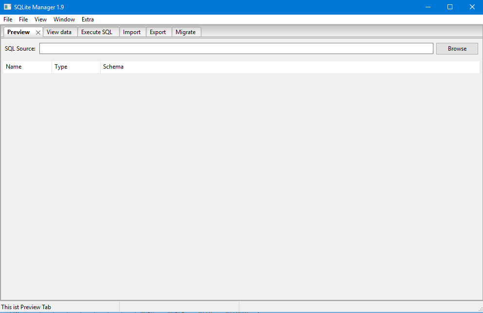
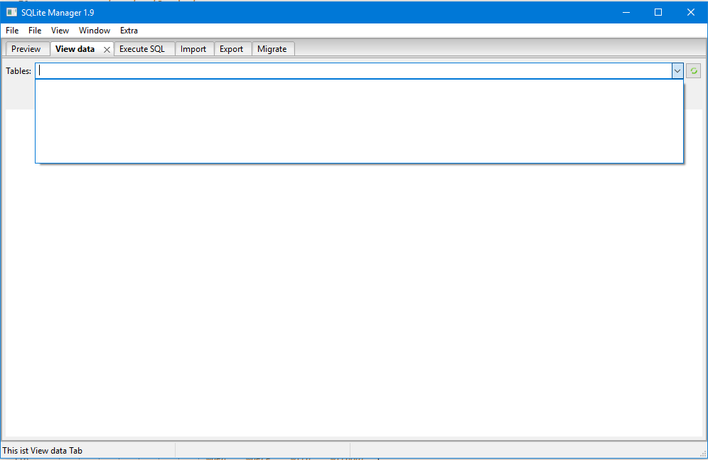
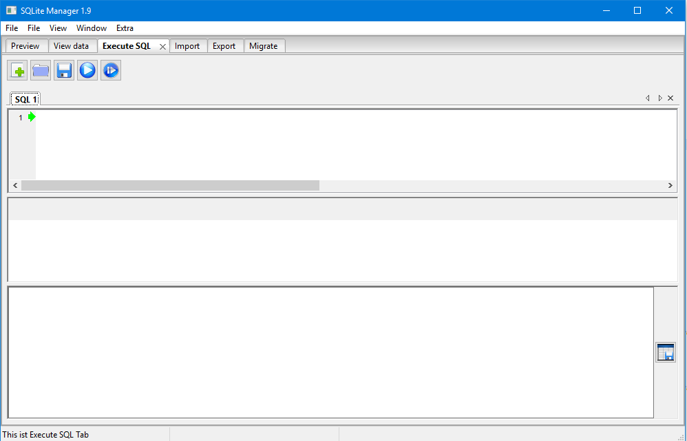
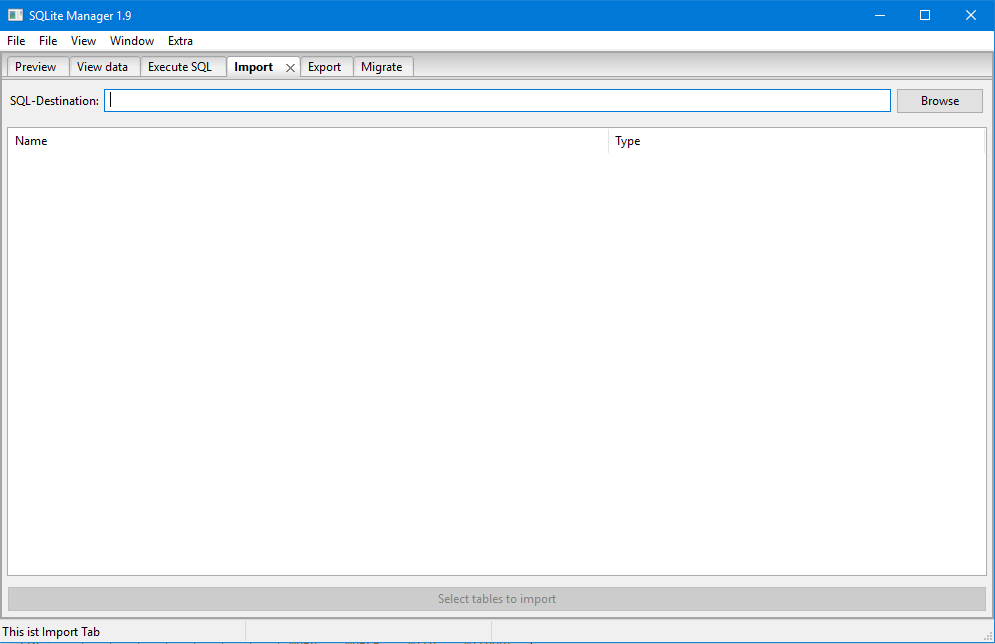
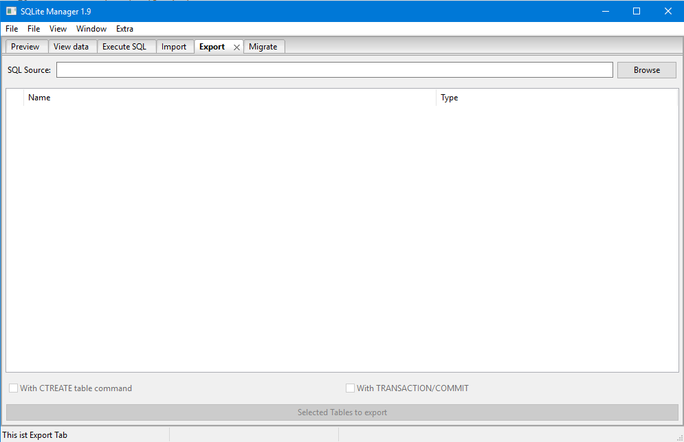
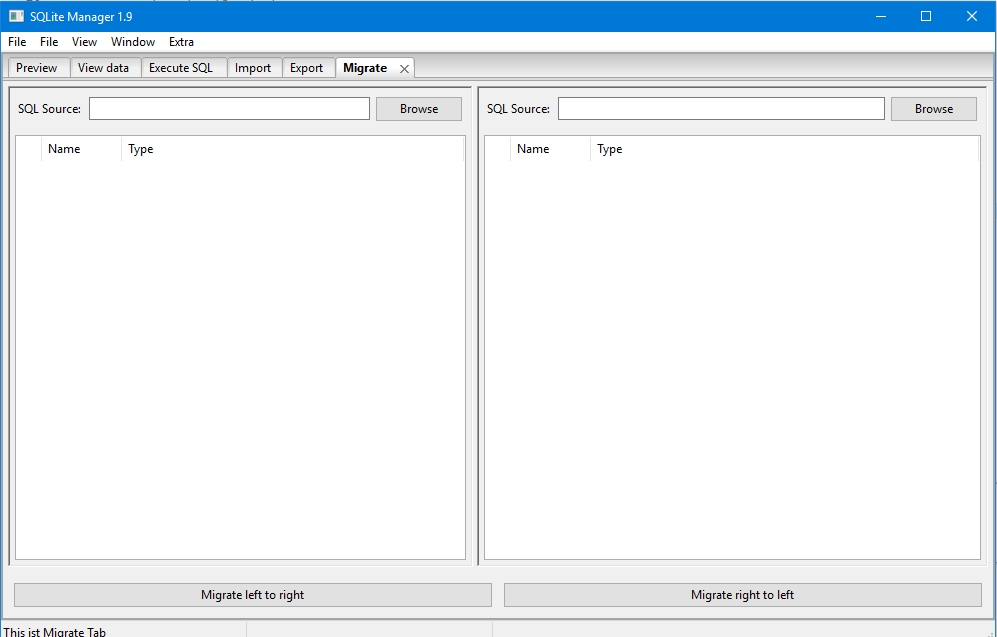

PySQLite a SQLite Manager Software
=======================================================

Instruction
--
This project is dedicated to develop a pure python SQLite database management software. With the help of the software, we can expert a SQLite database table and store it as a ".sql" file type. This file type ".sql" matches the Firefox plugin for SQLite Manager. At the same time you can also import a similar *.sql file into the SQLite database or directly migrate a data table from one database to another. All operations are visualized. To help some people who do not have very well knowledge of SQLite database, so that they may simply manage a SQLite database.

Project characteristics
--

- Operation visualization
- Interface simple
- Single python file
- High Compatibly
- Multi-language support

The software currently supports Chinese, English and German. You can set the display language by changing the "DEFAULT_LANGUAGE" global variable. If you have more questions, or better suggestions. Welcome to contact me.

Application interface introduction
--

#####The following is an introduction to the application interface.

	

This tab is used in the user list database to say that there are tables, views and triggers. It is also possible to display the data type and schema for each field of each table.

 
 
 
 
 
 
 
 
 
 
 

---

This tab looks at the data in each table in the User column, and the background color of different data types. Users can use the dropdown control to switch between tables. The button on the right mouse button copies the contents of the selected cell or selected line in the clipboard.

 
 
 
 
 
 
 
 
 
 

---

This tab is used to execute the sql command entered by the user. If the command is executed correctly, the execution result will be displayed. The execution report is displayed at the bottom. Sql can be imported from a file, or you can save the sql command as a file. Commands can be executed line by line or all at once.

 
 
 
 
 
 
 
 
 

---

This tab is used to import SQLite database tables.

 
 
 
 
 
 
 
 
 
 
 
 
 

---

This tab is used to export SQLite database tables.

 
 
 
 
 
 
 
 
 
 
 
 
 

---

This tab is used to migrate SQLite database tables.Of course the migration is two-way, meaning that this user can migrate a table from database A (left) to database B (right). Or the opposite direction.

 
 
 
 
 
 
 
 
 
 
 

---

License
--

The MIT License (MIT)

Copyright (c) 2018 Zhichao Wang

Permission is hereby granted, free of charge, to any person obtaining a copy of this software and associated documentation files (the "Software"), to deal in the Software without restriction, including without limitation the rights to use, copy, modify, merge, publish, distribute, sublicense, and/or sell copies of the Software, and to permit persons to whom the Software is furnished to do so, subject to the following conditions:

The above copyright notice and this permission notice shall be included in all copies or substantial portions of the Software.

THE SOFTWARE IS PROVIDED "AS IS", WITHOUT WARRANTY OF ANY KIND, EXPRESS OR IMPLIED, INCLUDING BUT NOT LIMITED TO THE WARRANTIES OF MERCHANTABILITY, FITNESS FOR A PARTICULAR PURPOSE AND NONINFRINGEMENT. IN NO EVENT SHALL THE AUTHORS OR COPYRIGHT HOLDERS BE LIABLE FOR ANY CLAIM, DAMAGES OR OTHER LIABILITY, WHETHER IN AN ACTION OF CONTRACT, TORT OR OTHERWISE, ARISING FROM, OUT OF OR IN CONNECTION WITH THE SOFTWARE OR THE USE OR OTHER DEALINGS IN THE SOFTWARE.

Free Software, Hell Yeah!
